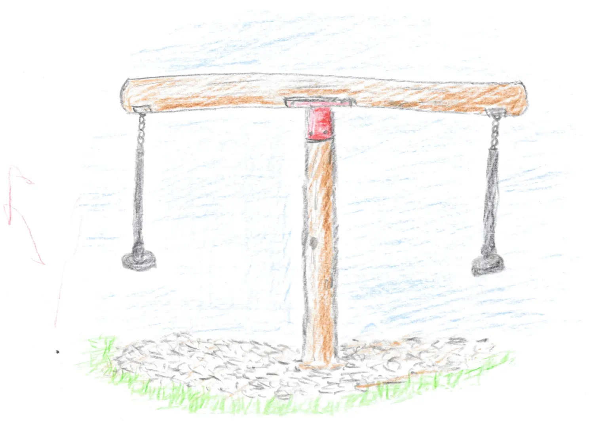

I'm still reading _Reconciliation: Healing the inner child_ by Thich Nhat Hanh and trying to slowly adjust my day-to-day habits to be more mindful. The latest exercise I tried was meditating and talking to my 5-year old self.

I haven't meditated in a while and I've never been good at visualization techniques. Both very good reasons to give it a try. So I sat down yesterday for ten minutes and tried to establish contact to a 5-year old version of myself.

It actually didn't take too long until I could bring up a few old photographs I remembered hanging on either my mum's or my grandma's wall. I probably wasn't exactly 5 years old, but I don't think the exercise requires that level of precision.

I imagined a young boy with short blonde hair, looking confused and a bit scared at an older man that seemed kinda familiar, but whom he couldn't place exactly. I gave him a reassuring smile, explained who I am and after a bit the young boy felt comfortable enough to talk to me and even be hugged.

It was a very nice feeling and quite easy to imagine as I still get to hug my own kids every day.

I encouraged my young self to take me along to play. My mind wandered to a place that I hadn't thought of in decades: the old playground in the town where I grew up.

Between 1988 and 1996, so from age 1 to 9, I lived in a small town called _Gomaringen_ in southern Germany. I spent a lot of time at my grandparents and whenever the weather was good enough, I'd end up in the nearby park with it's playground.[^the-old-playground]

There was a sandbox that I remember being enormous, but that was probably kid perception. There were also a set of swings and a little castle with a slide in it.

But, more importantly, in the middle of the park was a weird merry-go round seesaw thingy.

It consisted of two logs, one stuck in the earth as a pole and the other balanced on top. Two seats, similar to the ones used for zip lines on playgrounds, were hung on the ends of the log on top. You could go in circles, but the log on top wasn't fixed horizontally, so it would also seesaw up and down.

I haven't seen one of these in years. They were probably deemed too dangerous for kids at one point or another.

I can't really remember riding it much with friends. You'd have to both be running around in a circle and hop on at the right time. I mostly remember face planting a lot while running or scraping along the pieces of wood on the floor, because my friend didn't hop on at the exact same time.

However, with the help of an adult you could soar through the air. They'd just need to be running around in a big circle while a little kid is cackling with joy on the other side.

So that's what the two of us did. My younger self sat down and I took the reins. And after a while it was me pushed into the tiny round seat and hanging on, the wind blowing my hair back. I actually started feeling the warm elated dizziness of riding a merry-go round after a while.

I felt myself smiling as I was sitting on the sofa and twirling around at the same time.

And then my mind wandered on.

The kid was riding and I was running.

My older kid was riding and I was running.

I was riding and my grandpa was running.

While these visions started overlapping each other, I noticed that there was something wrong with the chain. I tried to imagine my father pulling me along as a kid...and couldn't.

That's not very surprising, but it kinda caught me off-guard yesterday. I haven't really thought about it for quite some time, but I grew up without a father for most of my childhood.

My dad left my mom when I was 10 months old. Well, he didn't leave as such, but rather vanished into thin air.

My dad had a severe gambling problem. He lost all our money and accumulated a lot of debt on top. A lot of debt that my mum ended up paying off over many years.[^amount-of-debt]

Nowadays it's pretty common for kids to grow up with their parents being separated. At least I feel like I see and hear it more often.

Back around 1990 I was the only one without a father. I didn't even notice it much until I started kindergarten. Kids started talking about their dads and eventually asked about my dad.

I can't remember anymore what my mum told me, but even at 5 years old, I knew about his gambling addiction, debt and money problems and that he vanished without a trace. We didn't even know if he was still alive.

Then, one day, the phone rang.

I remember myself sitting on the floor playing, when my mum walked up and said: "It's your dad. He's asking if you'd like to get to know him."

I was stunned.

My dad was alive.

I had a father.

...

But then I remembered the way he'd hurt my mom and how unhappy and overworked she was.

I told her: "No."

She relayed my answer and hung up the phone.

I started crying immediately after she put the phone down.

Of course I wanted to meet my dad. I loved (and still do love) my mum, but I wanted to meet the other half as well. Even if it was just to learn how not to make the same mistakes he did.

And I was scared to death that the decision I made was final and I couldn't go back on it and it was the wrong one and I'd be unhappy forever and...

My mum eventually managed to dig out the phone number of her estranged mother-in-law and so I did manage to meet my dad.

He's an okay guy, I guess. Made a couple of almost unforgivable mistakes that tore apart the lives of his family, but somehow we all managed to land on our feet.

There's a lot of weirdness surrounding my dad, but I never managed to drag up the courage to press him on all the hard questions. I tried to pry here and there, but I never had the feeling he gave me straight answers for the time he fell off the face of the earth. I eventually stopped asking.

He had remarried when he came back, lost his right ring finger[^ring-finger] and joined up with Jehovah's witnesses. Never went full on cultist or religious on me, but there were a few "sorry we can't attend due to religion" last minute cancellations.

As you can tell we don't have the best relationship. Somehow we never managed to really hit it off and find a common topic that we both enjoyed. For a time there were video games, but thinking back on that, I mostly played by myself while he sat in the background and watched quietly.

But he's still around. He came to our wedding and while he's also not grandpa-of-the-year material, he at least has met both his grandchildren. Nowadays we mostly send pictures and drop by maybe once or twice a year. We live about 250 km apart and it's been a while since he made the trip here himself.

We still don't have much to talk about.

All of these thoughts and memories flew by in a couple of minutes.

Coming back to the present, I knew a few things I could tell my 5-year old self.

_"Everything will work out."_

_"You'll meet a wife that loves you, have children that love you; all of whom you love back with all your heart."_

_"Your oldest kid is now four and half years old. You've already made it farther than your dad ever did. And I'm not thinking of giving up, nor is there a reason to."_

_"I'm not fixing all the mistakes my parents made, but I'm trying to fix as much as I can while keeping the good things that made us who we are today."_

[^the-old-playground]: I checked the internet yesterday and while the playground from my youth is obviously gone, the park still exists. In fact a new playground was built and opened to the public in 2017. Looking at the pictures online it looks amazing.

[^amount-of-debt]: My parents were about to buy a flat. It's 1988 prices, but still. Just to give you a rough idea of how much money went down the drain.

[^ring-finger]: According to him, he ripped it off when he tried to remove his wedding ring. His wife backed him up on the story when he told it. I don't believe a word of it.
