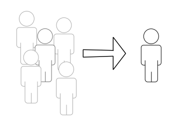

For the longest time I've always interpreted _being centered_ as something mostly physical. A strong stance. Nobody can shake you.

There are also some mental aspects to it: feeling confident, having full acceptance of your strengths and weaknesses.

But one aspect never popped up until now: being centered temporally.

Not thinking about what happened yesterday, or even in the conversation you had just now. Also not thinking ahead to what needs to be done tomorrow or worrying about things in the future.

We live in (at least) 4 dimensions, not just the 3 spacial dimensions around us, but also **time**. And while physical time travel hasn't been invented yet, there's still the chance to travel to past memories or future fears and hopes in your mind.

While trying to be more aware of what I'm doing right now, I've noticed this _oomph_ feeling whenever I catch myself drifting and pull back into the present moment.

It's kinda like a gentler superhero landing into my body.

The feeling is hard to describe. It's a bit like a part or even multiple parts of yourself are out of phase. The feeling of standing beside yourself.

And then once you notice this disassociation and give a gentle tug, everything falls into place. The phases converge, overlapping like layers of an image that suddenly form something complete.

I've observed in particular that this _oomph_ is the exact same feeling I get when I gently pull myself back to a meditation when my thoughts start drifting.

Well, just that I'm not meditating. Instead, I'm riding my bike, folding clothes or doing the dishes.

Here are a few things I use to give myself a tug.

- Look at the people and vehicles around me when I'm riding the bike.
- The traffic light is glowing red, but other than that? Is it dirty? Is there an interesting sticker on it?
- I want to fold this shirt carefully, so it's roughly the same size as the others.
- Do I need to pull this into shape first?
- Is this dish fully cleaned?
- Can I let this thing dry off or do I need to wipe it dry?

I'm still not sure if this alone is enough to give anybody else the _oomph_ feeling. I have a rather long history with meditation, Taiji and a few other techniques for stress relief. I haven't practiced any of these for a while now, but there's still a chance that these past experiences make it a bit easier for me.

Your mileage may vary, but then again I think it's so little effort that it's well worth giving it a try.

Let me know if you do and tell me if it helped. I'd be happy to hear about your experiences.
