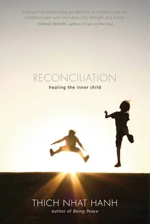
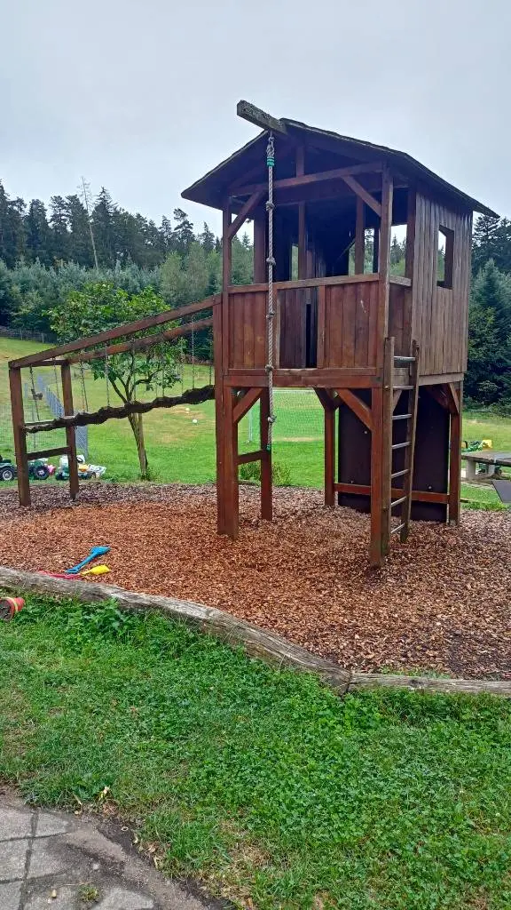
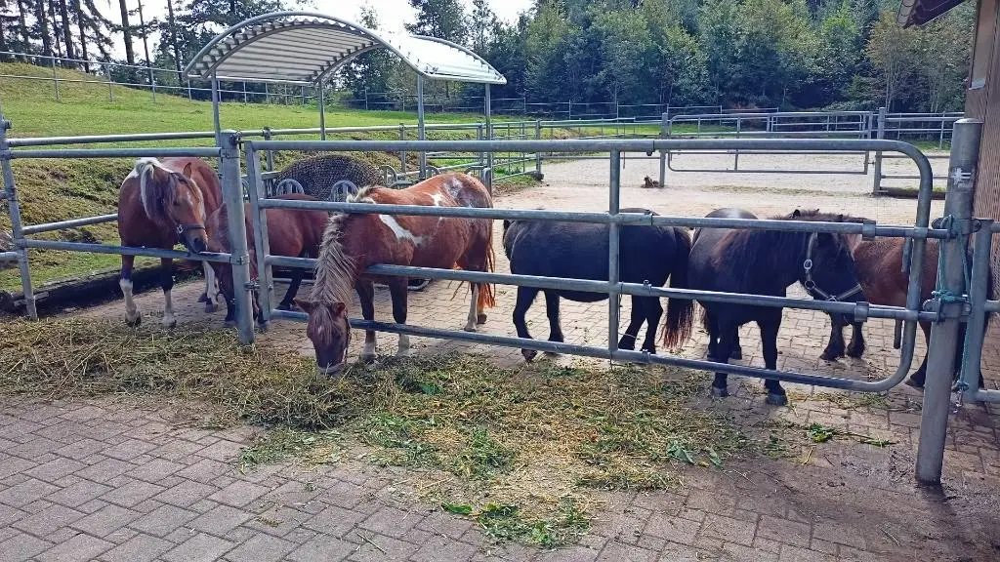
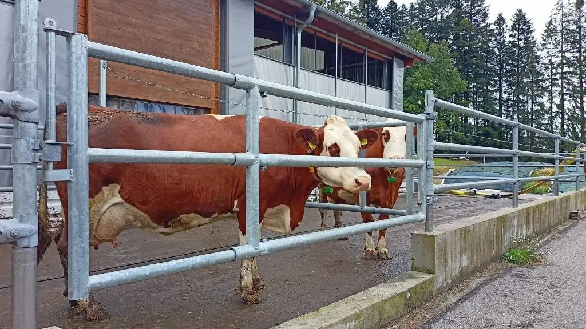

I've been angry a lot these last few weeks. I've been carrying a great big burning ball of anger inside me that threatens to burst out. Occasionally it does, too.

My older child is now about 4.5 years old. He's craving autonomy and control. Control over everything: his body, his parents, his brother, his surroundings...

It's maddening. He does so many small things that drive me **crazy**!!!

...

But ultimately these are all just small things.

Who cares if he blocks the sink, so the water can't run off? I can always push the lever and everything is back to normal.

Who cares if he turns on the lights in the middle of the day? Once he's distracted I can just turn them all off again.

Who cares if he abuses the bed for a trampoline? So what if he sings his favorite songs loudly all day long?

...

Well...I do. Kinda.

As you can tell we've been butting heads a lot in the last few weeks. Months really.

It's not just washing hands, going to bed or the toilet or sitting down for a proper meal either. The constant fighting and bickering have me tethering so close to the edge that the smallest things can set me off.

And I am observant enough to realize that I'm slipping into _old habits_. Not my _old habits_ either, but rather what my mom and grandparents (and to a lesser extent my stepdad) imprinted on me as a child.

I find myself reiterating the same hollow phrases and resorting to empty threats to get him _to do what I want_. Deep down I realize that it's stupid, but I find it hard to break out.[^wife]

Last week I stumbled upon the [Humble Book Bundle: Thich Nhat Hanh's Zen Library Books](https://www.humblebundle.com/books/thich-nhat-hanhs-zen-library-books)[^dead-link]. Every now and then I feel like reading a spiritual book and whenever I do, I'm drawn to Buddhist knowledge and / or mindfulness guides.

Rifling through the selection of books, I found _Reconciliation: Healing the inner child_. The title spoke to me immediately.

We're currently on vacation on a nearby farm, about an hour's drive by car from our home, so today I finally decided to get started with the book.

I promised my son that I'd take him out, so he can play while his little brother has his nap. But I also told him, that I was intending to read a book and that he'd need to find things to keep him occupied.

There are tons of animals running around, a huge playground with all matters of houses, ladders, slides, swings, etc. and countless small vehicles to "drive" around. While he's usually bored very quickly if nobody plays with him or at least pays attention to what he's doing, I thought this time it would work out.

And interestingly enough it did.

He went off to play on the swing and I sat down to read the book.

I got most of the way through the introduction, where it mentioned the ignored inner child that requires attention. It didn't even mention any techniques yet, but nevertheless I felt a wave of sadness at first, followed by a kind of acceptance and an idea of what I could do **right now**.

In fact, I had an expert with me who could help.

I looked over at my son on the swing and I went over. He had asked me a few hours before if I could give him a push, so I offered my help.

"I remember you asked if I can give you a push ealier? Do you want help now?", I asked.

"Nevermind, dad." He looked at me with a sparkle of adventure. "I'm on a ship now."

"Oh cool. Where are you sailing to? A treasure island?"

"No, dad. I'm not a pirate. It's a space ship and I'm an astronaut!"

"Neat! So are you just flying around or going somewhere in particular?"

"I'm going into space." And after a short hesitation, he continued: "Do you want to come with?"

"Sure. Just let me get on my space suit. Can't go into outer space without a suit and a helmet."

So I put on my suit and off we went. We visited planets 1 through 9 -- no relation to our actual planetary system. We met some fierce extraterrestrials which my space captain quickly ran off, but also some terrestrial cows and ponies ("No, these are _normal_ ponies, dad.").

It's been years since I've last used my imagination in this way. I'm always sad whenever I think about how creative and imaginative (day-and-night-dreamy) I used to be as a kid. I usually feel like this part of me is gone forever, however today was the first time I felt hopeful that there's a chance that I can reignite this spark.

We talked and played for well over an hour. My book lay forgotten on the bench while we were off to explore the countless sequentially numbered planets we could reach with our rocket ships.

----

If you want a happy end, you should probably stop reading here. 😬

I'm not saying this afternoon didn't help at all. But sadly the ball of anger returned in the late afternoon. We circled around the same familiar topics and when it finally became bedtime I was again very much done with the day.

However, writing down all these feelings and the amazing afternoon playtime we spent together helps. So often _life™_ interjects in the way of work or household chores. There's always _something_ to do and with it the fear of things piling up when all I really want is some rest.

I need to remind myself every now and then that I should not just "spend time with my kids (while taking care of business)", but actually slow down and immerse myself in their play.

[^wife]: Shout-outs to my wife here too. She's a kindergarten teacher and pointed out these imprinted habits to me in the first place. I don't think I would be even close to this point in self-reflection without her.
[^dead-link]: The link is most likely dead when you read it, because the offer will have run out.
