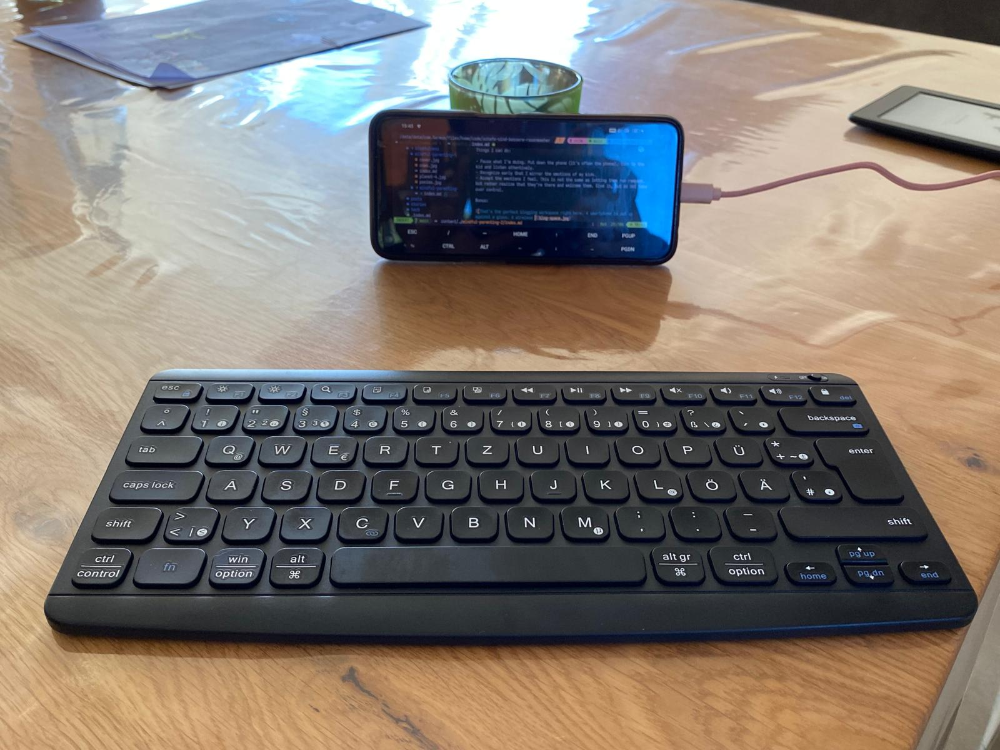

Things I've noticed so far:

- I'm often annoyed when my kids want to talk to me. I'm usually already doing something else.
- I'm more open to pay attention to my younger son. I don't think it's favoritism, although things are definitely easier with him. He plays a lot by himself and is more emotionally balanced...for now.
- No matter how hard I try, there will be times where I simply cannot attend to my kids. Work needs to be done, bills paid, groceries need to be bought and prepared. Not everything can happen when the kids are in bed.
- A bit ashamed that I only think about this now, but I've known for a long time that I'm susceptible to the emotions of other people. My older son becomes angry very quickly right now and that triggers me. 

Things I can do:

- Pause what I'm doing. Put down the phone (it's often the phone), turn to the kid and listen attentively.
- Recognize early that I mirror the emotions of my kids.
- Accept the emotions I feel. This is not the same as letting them run rampant, but rather realize that they're there and welcome them. Give in, but do not hand over control.

Bonus:

