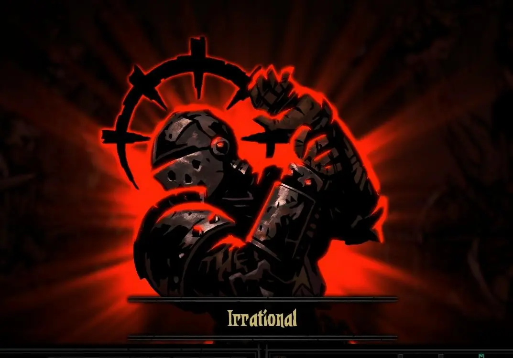
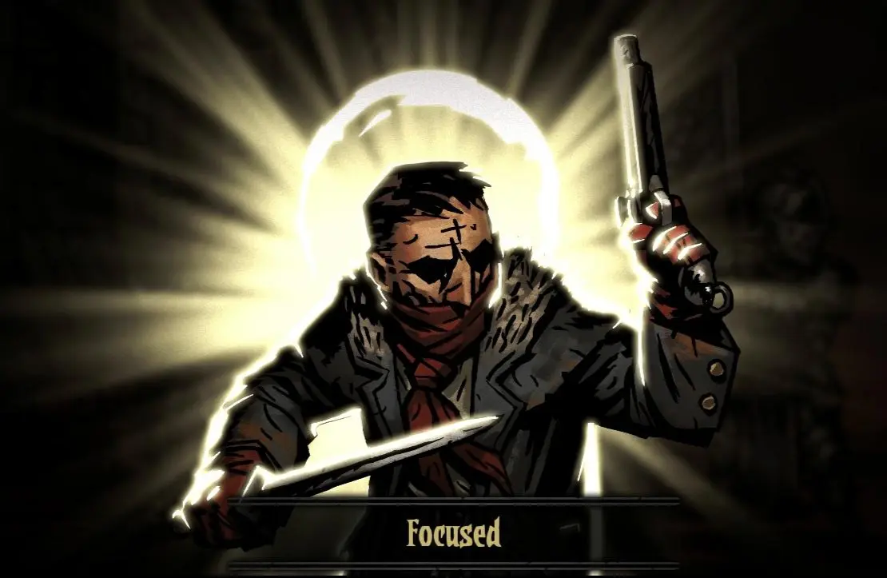

I've only been back on the Mindfulness train a few days, but I'm already noticing so many small things.

## Less things break

It's kinda obvious in hindsight, but less things break when you're being more careful. I'm not deliberately trying to be more careful, but whenever I can I try to keep myself in the moment.

An easy example that comes to mind is: "Why isn't this budging!? Maybe if I apply more force, it'll...well, shit..."

Now, when I notice that something is stuck, I pause, tug at it in a few different directions to determine where the resistance is coming from and then carefully work around the resistance.

Overall, I'm also enjoying things more. The book _Reconciliation: Healing the inner child_ by Thich Nhat Hanh that I'm currently reading mentions doing things mindfully versus letting the subconscious take over[^unconscious].

You can get pretty far by going on auto-pilot, but things will never be 100% exactly the same. I tend to do things fast and often kinda _throw_ stuff, instead of placing it carefully, so every now and then I'll miss a move and my subconscious will violently pull me into the present moment to fix things -- or more often, just watch helplessly as something plummets to it's inevitable doom.

Not to say that I constantly break stuff, but I've noticed a few occasions already where I would have applied the wrong kind of force.

## Consuming less media

Staying in the moment in particular means **no distractions**. So I haven't listened to any podcasts or music and I also try (still struggling a bit) to limit scrolling through my Mastodon timeline to times where I'm not supposed to do something else.

The thought that _"I'm falling behind on my podcasts"_ has come up, but **it didn't bother me**.

I've also had little time to play videogames, but I'm okay with that too.

Overall I no longer feel that I need to push myself to get household chores done as quickly as possible (and _break_ things). Instead I take my time and try to find some enjoyment in the activities.

Despite my initial scepticism, I usually do indeed find something.

## Reconnecting with my body

Until about 2.5 years ago, I was a Taiji student. Not to toot my own horn too much, but I did indeed develop a certain awareness for how my body moves and what I could do better to make the movements healthier.

I stopped going to practice when my second kid was born and I haven't practiced the Taiji moveset for myself more than five times since. I'm not even sure if I could reconstruct the entire sequence from memory without some guidance.

Having said all that, I noticed that I can still tap into this awareness, when I'm moving deliberately. Keeping myself in the moment also applies to times where I'm "just walking". Around the flat, down the stairs, along a gravel road.

While I am overweight and very out of shape, I can push myself to do a lot of things. I bike to work every day, try to climb stairs whenever I can, go hiking, help friends move. I'd like to think that I can still do everything any average person can accomplish.

Nevertheless, in the last few years I have started to feel my weight (and probably also my age). My knees hurt, my back hurts, I have some weird blockade in my right wrist.

Now, being more mindful when I'm moving helps me adjust my steps ever so slightly, so that I align my knees properly before putting weight on them. The pain is still there, but it's getting better.

There's also another surprising development: I stopped over-eating.
Especially in the last few weeks, where my stress levels were at a constant all-time high, I noticed that I was continuously craving food. I would eat any left-overs after dinners, scavenge the fridge late in the evening and snack whatever and whenever I could.

It just stopped.

I actually had a few evenings where I didn't eat dinner at all. I was still full from a light afternoon snack (or maybe even lunch).

Previously throwing left-over food away -- especially the tasty unhealthy kind -- felt _wrong_.

It still feels wasteful to throw food away, but I no longer feel the unreasonable urge to put it in my body.

## Staying calm

My main goal: how can I stay calm when my kids are driving me fucKING UP THEWaLL!!!!!111!

I was never big into _Darkest Dungeon_, a roguelike tactics videogame. However, the game has a _stress_ mechanic that I could relate to very well.

When you spend too much time crawling through dungeons in the dark and getting attacked by weird monsters, the stress level of each character rises until it hits a breaking point. And then...

At least this is what usually happens. However, there's a very small stat-based chance that characters will instead prevail and get a second wind.

I've noticed something very similar happen to me. At least in the last few weeks I failed my stat check every single time and would go into a shouting rage when I reached my breaking point. Prior to that I've had a few occasions where I noticed I was fast approaching the point of no return and managed to swerve into _epic parenting mode_ at just the right moment. I would then calmly address my kids and defuse the situation.

As it turns out, I can just trigger this. And by accident I've also just written down why. If I'm aware that I'm about to blow my top, I can steel myself and get ready to draw a very long and deep breath. Being mindful in the moment immediately unlocked this for me.

## Bonus: tackling my fears

I am afraid of heights. It's also triggered by very specific things, not all of which I understand.

One thing that'll trigger me is when the guard rails are too low. I noticed this when I was in the very first row on the second floor of a church during a sermon.

Another thing is watching the floor approach slowly. I very vividly remember riding down the elevator on the Eiffel tower and nearly breaking my then-girlfriend in half, because I had nothing else to hold on to.

Walking along the edge of the cliffs of Moher felt perfectly fine, while walking on a narrow ledge along the Swiss Alps made my heart beat so fast that I thought it'd give out then and there.

To the best of my knowledge I haven't always had this fear. I can think of one very specific moment where this might have formed, though.

When I was 11 or 12, I spent a short time living in a small village called Lonsingen on the Swabian Alps. Me and my friends would dick around in the streets or in the nearby forest.

The forest was forbidden -- it belonged to a farmer in the village and was securely cordoned off with a barbed wire fence. That didn't stop us of course.

One day, we decided to climb one of the huge trees. I guess it was a fir tree. Something with low hanging branches that were easy to climb.

My memory is a bit hazy, so I might be overestimating the size a bit. I'm somewhat sure that it was at least as high as a three-story building. We must have been at least 10 meters up.

My friend stopped climbing somewhere in the middle, but I pushed on until I was pretty close to the treetop. The view was amazing. I can still recall holding on to the tree trunk up there, gently swaying in the wind.

I started making my way back down again. I climbed steadily, because branches were pretty evenly spaced.

Suddenly however, my feet dropped away and were dangling freely below me. I was gripping on to the branch above me for dear life, frantically trying to find a branch to step onto -- but there was nothing there.

Eventually my strength gave out and I dropped --

Right onto a thick branch that must have been just a few centimeters out of reach. I landed on it perfectly and had all the sense in the world to throw my wobbly arms around the tree trunk and grab on until the shaking stopped.

Sorry for taking such a long trip down memory lane. I kinda like that story. I was such a stupid kid and it's honestly a major miracle that I'm still alive today.

Getting back to today...

In particular this is the longest cable car ride of this specific type in Germany, the [Schauinslandbahn](https://en.m.wikipedia.org/wiki/Schauinslandbahn). I've ridden this beast a few times, but I always forget that I get vertigo at a certain point.

I still haven't figured out exactly what causes it, because I usually don't get vertigo when I am inside a cable car and I feel perfectly fine 80% of the ride up and down. The car wasn't even shaking that much.

Nevertheless, pretty much out of nowhere and with no warning signs I was hit with extreme vertigo. Cold sweat formed on my forehead, my breath was going rugged and I could feel the skin in my hand being stretched by gripping the handholds so hard. I had to close my eyes and started shaking all over.

I took a deep breath.

And then another.

And then I accepted my fear.

I was never ashamed of my fear of heights. It's not that kind of acceptance. It's rather _I accept that I'm feeling fear right now -- and it's perfectly fine_.

And just as suddenly I was calm again.

My breath slowed down and eventually I could open my eyes again and enjoy the view of the distant mountains of the Vosges in France.

## What now?

This has been an amazing week so far. I haven't even changed my behavior that much, but my mind is blown by the effects I've observed.

I'm still a bit wary though, because I've just returned from a week of family vacation on a remote farm and I've managed to eke out a few more vacation days from work. So, I'm not at my usual stress levels and not context switching as wildly as I usually do.

The real exam will be next week when I'll be back to juggling work and family life -- especially when I'm working from home in the afternoons.

[^unconscious]: The book uses the term _store consciousness_ meaning habits stored in memory (I guess). In Western psychology it's called _the unconscious mind_.
