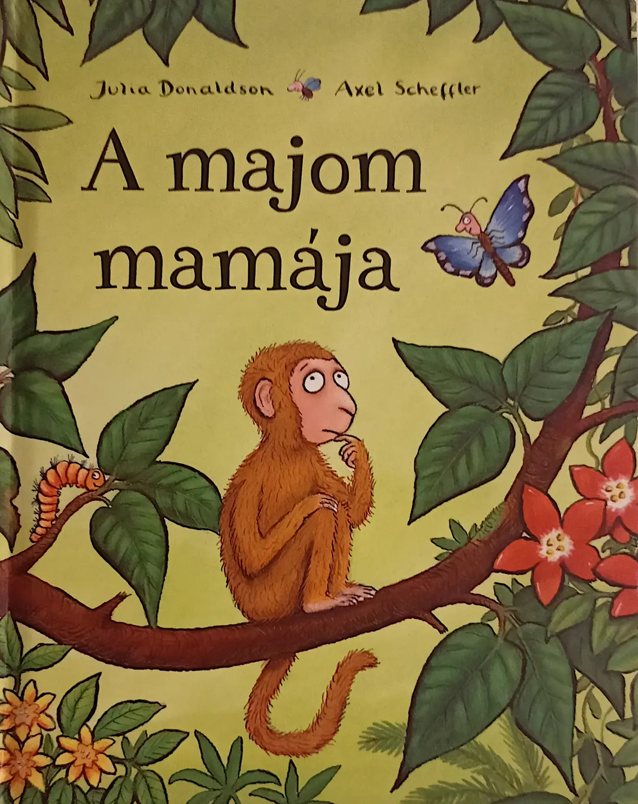

2023 hasn't been a big reading year for me. I tend to alternate very heavily between watching movies and tv shows, playing videogames and reading books. This year I've been playing a lot of videogames with what little free time I have.

Nevertheless, I do have a candidate for my _book of the year 2023_: **A majom mamája**.

The book is written by Julia Donaldson, an English writer mostly known for _The Gruffalo_ or _Room on the Broom_, and illustrated by Axel Scheffler. It's original title is [Monkey Puzzle](https://en.wikipedia.org/wiki/Monkey_Puzzle_(book)).

It's a children's book about a monkey who has lost her mother. A butterfly tries to help her and shows her many different jungle animals that match the monkey's partial descriptions of her mother. Here's an example.

> - Nincs rajta se karom, se toll, se szárny,  
>   S nem repül, hanem csak ugrál a fán.  
> - Azt mondod, ugrálni nagyon szeret?  
>   Akkor már sejtem, hogy melyik lehet.  
> - Nem, nem, nem! Nem ő az.  
>   Ez egy béka!

Here's a rough translation of it.

> - She doesn't have claws, feathers or wings,  
>   and she doesn't fly, but instead jumps on trees.  
> - So you say she likes to jump?  
>   Then I know which one she might be.  
> - No, no, no! That's not her.  
>   That's a frog!

And so it goes until the big twist. Which me -- being 36 years old -- actually didn't see coming, but makes the book all the more charming. 😅

But why am I reading a children's book in the first place? And why is it Hungarian?

This was actually a gift my kids got for their baptism. I'm half Hungarian on my mother's side (or grandma as she's now called). I grew up bilingual and I'd say I could speak Hungarian fluently with a pretty good vocabulary until roughly my late teens.

My mom and I exclusively talked in Hungarian until I was nine or ten. We switched to German when she remarried, so nobody would feel left out of the conversation. My grandparents spoke only very little German, so we continued talking Hungarian.

However, my vocabulary quickly diminished once I moved further away from my own grandparents -- who are sadly no longer with us.

Whenever I'm exposed to the language I feel it stirring in the back of my head until a few words pop back up from memory. Interestingly enough my pronunciation doesn't seem to have suffered.

When I visited Budapest a few years ago I tried my very best to only use Hungarian when I talked to locals. On one such occasion the bartender I was talking to asked me where I was from. I apologized for my accent and bad pronunciation and told him, that I'm from Germany. He was quite surprised at that and replied: "your pronunciation isn't bad, it's just that I couldn't quite figure out what part of the country you're from."

Nevertheless, even though I grew up bilingual, I never learned to read or write Hungarian. Over the years I kinda figured out a few things. Like most languages, once you've learned how to pronounce certain combinations of letters, you'll be able to recognized the words. The one thing I remember almost like an epiphany was when I figured out the difference between _s_, _sz_, _z_ and _zs_. Yes, Hungarian uses all four of these and they are all distinct sounds. 😅

Three of these four are actually pretty easy to map onto German and the last one (_zs_) is something that you can map onto English. That's kinda what I did in my head when I started learning how to read. You can get pretty far with this.

| Hungarian  | German   | English   |
|-------------- | -------------- | -------------- |
| s    | 'sch' as in schade     | 'sh' as in shy    |
| sz  | a hard 's' as in 'Biss' | 's' as in sun |
| z  | a soft 's' as in 'Sonne' (depends a bit on the region) | 's' as in reason |
| zs | 'g' as in genre (not necessarily a very German word) | 's' as in pleasure or 'g' as in genre |

I unlocked another mnemonic aid when I read this book to my kids: all vowels without an accent are _schwa_ sounds. If they have an accent they sound pretty much just like the German vowel would sound -- without the accent, because we boring Germans don't have such devilishly complicated things as accents. 😅 I spent enough time in Swabia and picked up a bit of the dialect, so I know whereabouts in the throat these should sit.

It also took me a while to realize that the book is written as a poem and supposed to rhyme. Once I got that, I even learned how to pronounce a few more words.

Rediscovering the Hungarian language is of course the main reason why this book in particular has touched my heart, but there is something else I wanted to mention.

My kids are still pretty young, the elder one being just shy of four years old, and neither of them are patient enough to listen to really long stories. Now the book is actually pretty short and written in rhymes, but I tend to translate everything once I've read a passage and discuss some of the images. So a reading might drag on for at least 20 minutes. However, my kids have absolutely no problem staying quiet and listening to me read this book. The elder one is even picking up a few words here and there. 😍

I won't be able to teach the two of them Hungarian and grandma lives too far away for constant training, so it's unlikely that they'll ever learn to speak the language fluently. But at least they get a little bit of exposure and I get to remember a bit of my own childhood. It really is a very melodic language that I always enjoy hearing.

And I'm sooooo damn lucky to have learned the grammar naturally, because it is insanely complex. 😬
