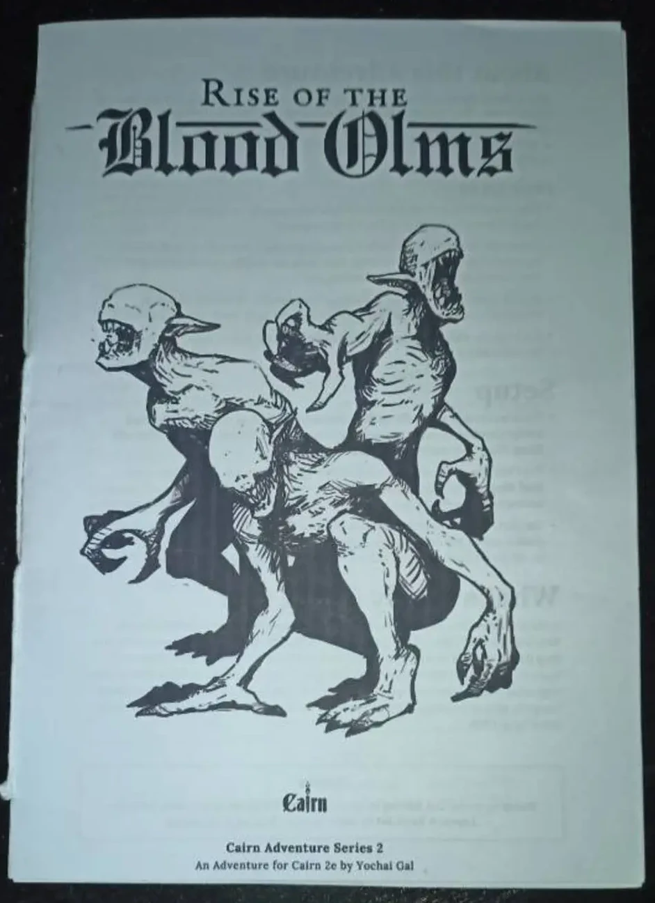
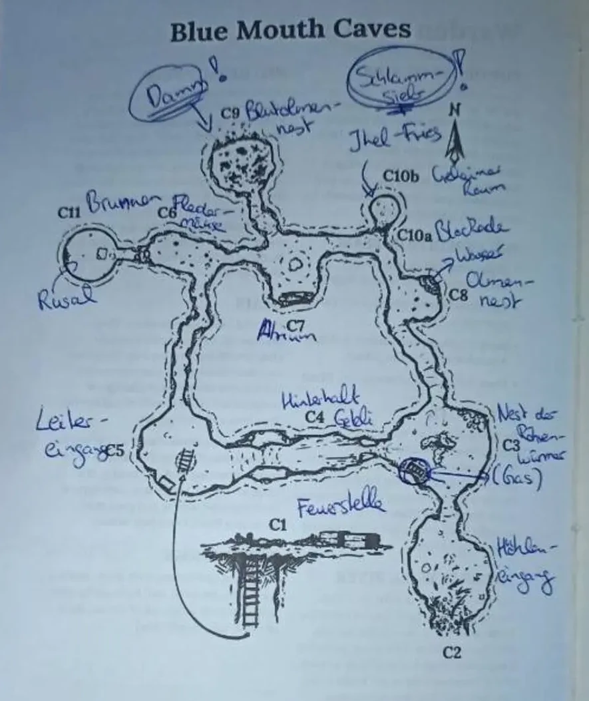

I GM'ed [_Rise of the Blood Olms_](https://yochaigal.itch.io/rise-of-the-blood-olms) for my TTRPG group, a one-shot adventure for Cairn 2e.

We are currently in the middle of a multi-evening adventure, but our regular GM had to cancel on short notice. I decided to jump in and asked around on the Fediverse if anybody knew an adventure for

- 2-4 players (we're 4 people + 1 GM, but I wasn't sure if everybody was up for a one-shot),
- 1.5h,
- set in a Pathfinder / D&D fantasy world,
- that I could prep in a few hours, ideally by just reading it once.

Thanks to [Bodo Heye](https://rollenspiel.social/@HeyeBodo) I found _Blood Olms_.

I'm not familiar with Cairn 2e, but it _seemed_ easy enough to respec (we'll come back to that later!) and I was very impressed by how well it was structured. Indeed, I read through it carefully in about 45 minutes and felt pretty much ready to GM it right away.

Here's how it went.



## Review of the adventure


I haven't read many published adventures. In fact _Blood Olms_ was the very first one I actually GM'ed for a group.

I usually just come up with a (subjectively) good plot hook, massage it until a sensible background plot forms and then try to mold it into something that complements the PCs.

I went with a pre-made adventure, because 24h seemed like a very short time to come up with something myself, especially with a full day of work and two small kids.

Excuse me if I'm gushing over some totally obvious things, but as I've said, I haven't worked with many pre-made adventures yet.


On the very first page, there are two distinct sections:

- _setup_ -- what the characters know and how they got here and
- _what's really going on_.

I found this really helpful. It gave me all the context for the rest of the module. In fact, I could have just taken the premise and built my own adventure around it. I really liked how it's clearly split between player and GM knowledge, the latter of which gives me enough to improvise.

These short paragraphs introduce a few key words (organizations, big players, locations, creatures) which are further fleshed out and explained on the next page.

Next is an overhead map of the cave, followed by detailed descriptions of every room and/or corridor. Again, the descriptions of the individual rooms are on point. There are one or two sentences that give a quick overview. The things that PCs can interact with or examine are printed in bold and get an extra paragraph below the general description. The added details include stats, e.g. how much damage an explosion does or the contents of a crate.

There's only one major NPC in the dungeon and he gets a full page. Other minor NPCs and creatures, including their stat blocks get another page.

The small booklet also contains a few images, most of which I liked. Only _Rusal_, the major NPC I mentioned earlier looks like he jumped out of a bad saturday morning cartoon. Well, in all fairness...I kinda played him like that as well.

Overall, I was very impressed with the layout and structure. The information is nicely aggregated and you rarely need to flip pages.

When I actually ran the game, I noticed that I did flip between pages a lot, especially near the end. However, now with a clearer mind it seems pretty obvious where everything is. I'll take the blame for messing that up, because right now I can't think of any way they could have improved on what we get here.

The plot itself is pretty basic. A group of scholars go missing and the PCs are sent out to investigate and return a valuable relic and any survivors.

What is impressive however is the dungeon ecology. There's a well thought out balanced ecosystem that is upset by the intruding scholars. It actually took me a while to notice how thoroughly everything fit together -- well after I had already finished running the game.

## What happened in our session

> Spoilers ahead for _Rise of the Blood Olms_!!!

The PCs followed Silversilk River and arrived at the campsite in the early evening. A hole had been dug straight into the ground, with a rope ladder leading down into it.

They examined the abandoned campsite, followed the scent of rotten flesh and discovered a crate of rotten Red Hermit Tree fruit as the source of the smell. They found a pickaxe in a pile of slightly rusty digging tools in another crate.

Upon examining the four sleeping bags and the ground around it, they discovered footsteps. While the rest of the group was discussing if they should descend the rope ladder, Jakob the barbarian took it upon himself to follow the footsteps in the muddy ground to a nearby cave entrance. He loudly declared "HEY EVERYBODY! THE STEPS LEAD TO A CAVE!!!"

All the PCs assembled in front of the cave and Bindel the halfling, being the smallest and most stealthy of the group, decided to scout ahead. He snuck up to and into the cave where he lit a torch to penetrate the darkness. This ignited the methane gas that had accumulated in the chamber and caused a massive explosion. Bindel, who was caught in the middle of it, survived with major burns, while the rest of the group in front of the cave suffered minor injuries.

After recovering from the explosion, the rest of the group moved into the entrance chamber. Wary of lighting another fire, Alari decided to use her magic to make the extinguished torch glow with a faint blue light. Now that they were able to examine the chamber, they found the burnt remains of a few tube-like worm creatures and discovered that the chamber had two exits. They decided to follow the path to the west, through a small gap. Despite his burns, Bindel volunteered again to scout ahead.

He noticed immediately that the path had been artificially made smaller by piling up rocks to the left and to the right. On a whim, he decided to climb the rocks. Before reaching the top, he wedged himself between the two blockades and took out the magically lit torch. He waved it around and just before he was about to put it away again, he observed the tip of a blue leather boot sticking out of the shadows on the ledge.

Bindel decided to return to the rest of the group. While they huddled around and listened to his report, they heard the sound of tumbling rocks and maniacal cackling retreating down the corridor.

Bindel, Alari and Goram climbed the rocks to the lower ledge, from where Alari leapt to the higher ledge. Examining the ground, she found signs that a larger, bare-footed creature had hid here at some point.

In the meantime Jakob and Orikour had advanced to the next room, where the rest quickly joined them. They found a rope ladder hanging from a hole in the ceiling, which they surmised would lead to the abandoned campsite. In a corner they also found an unlocked iron chest with a few pitons and some dried rations.

There was only one exit apart from where they had come from, so they advanced in that direction through a winding corridor. After a while they could hear high pitched chirps and the sound of flapping wings. Alari quickly recognized this as the sound of bats and was proven right when the group exited from the corridor into a cavern filled with an awful stench and the tell-tale signs of Guano on the ground.

Ignoring the closer exit, Alari decided to carefully traverse the chamber below the bats to examine a large white fungus growing at the far wall. She discovered that the fungus was hiding a small tunnel.

Bindel decided to crawl through the tunnel and found himself in a circular room with walls of cut stone. He turned around slowly, letting the magic glow of his torch swipe over the room -- until it fell on a frog-like humanoid cowering next to him. Both let out a piercing scream.

Once they had calmed down, Bindel introduced himself to the person. The other introduced himself as Rusal. When asked for food, Bindel gave Rusal both rations they had found earlier, which Rusal then proceeded to noisily devour.

Once he had eaten, Rusal explained that outsiders had come and upset the balance in the cave. The water had stopped and with it the food source of the cave's inhabitants. Rusal asked the party if they could restore the water, but when asked if he would help them, he declined without further explanation. Bindel promised that they would take care of it.

Meanwhile the rest of the group had decided to risk lighting another torch. Bindel returned to the bat cave and together they advanced to a large chamber with a Red Hermit Tree growing from the ceiling. They discovered the dismembered remains of two scholars. Traversing the walls, Bindel found two additional exits, one of which had a small trickle of water running from it.

Together the group decided to continue down the path without trickling water, although Bindel was very vocal about returning to restore the water. They found themselves in another long corridor with very obvious shoe prints on the ground. The shoe prints vanished into a mud wall. Jakob loudly proclaimed "WE CAN WALK THROUGH THAT!" and proceeded to try exactly that. While he couldn't pass through the wall, he had alerted someone on the other side of it. He could clearly hear muffled shouting.

Using the pickaxe from the campsite, they tore down the wall and discovered Jhel-Fries, a teenage girl who the scholars had hired as a caving guide. She rambled erratically that people were dead, something about harvesting fruits and High Lector Geteli going mad and..._things_ in the darkness. Orikour noticed that she was desperately clutching something in her arms. When asked about it, she told them that it was a relic. Further prodding revealed that it was the Mud Sieve the group was looking for.

Deciding that they didn't want to risk a confrontation with _things_, they decided to retreat to the cavern with the rope ladder and exit the cave. After they had taken a few steps, they heard the mad cackling from earlier again. The cackling turned to sobbing and then a drawn out scream that was cut short, leaving an uncomfortable silence.

They made their way back through the atrium and the bat cave. When Orikour and Jakob exited from the corridor into the room with the rope ladder, a long pale arm with claws reached out of the darkness and snuffed out the torch Jakob was holding.

Something attacked Jakob in the darkness and left deep bloody scratches. Bindel, who was still in the corridor, threw the magically glowing torch over Jakobs head far into the chamber. Jakob, who could now see his attacker, a gaunt and eyeless pale beast with long extremities and sharp claws, unleashed his rage on it and tore the creature to pieces.

Orikour instinctively looked around and discovered another beast hanging on the wall, ready to pounce. He threw his hand-axe and split the eyeless face down the middle, upon which the beast went limp and tumbled to the ground.

They scrambled up the rope ladder and retreated to safety.

## Lessons learned

This is not immediately related to _Blood Olms_, but rather a more generic retrospective of this quick 'n' dirty emergency session I ran.

### Lessons I learned as a GM

#### Crunch the numbers!

I'm not familiar with the Cairn rules and while the module looked like it would be easy to respec, I absolutely misjudged the numbers. The module can be deadly, but **not** if you run it with 3rd level D&D characters.

Instead of just looking at the damage a blood olm can do, I **should have looked at a few more numbers and done some quick calculations** how that would play out with 3rd level PCs.

As an alternative I could also have opted against 3rd level PCs.

#### Have everybody bring their B character!

We used pre-generated characters I found on [dnd5etools.com](https://dnd5etools.com/pregen-characters.html). The main reason was, that I did not want my players to steamroll the adventure with the 5th level PCs they have.

Using the main characters comes with a bunch of other problems too. One thing is "why are they here and how does this tie into the main plot?" We can just decide that it **doesn't** tie into the main plot, but the temptation to do so is still there. I think it takes something away from the characters, if some adventures they go on are not canonical. And after a while it's just confusing.

The other thing that comes to mind is the question "what happens when the PC dies?" If the adventure is not canonical, does it even matter? If we tie it to the main plot, how do we deal with a major player dying somewhere else?

Using pre-generated characters seemed like the easiest solution, especially given that we wanted to play the next day and everybody else had a full day of work too.

But in hindsight I realized that it doesn't help if _nobody_ is familiar with the character. I sent the sheets around in the early afternoon, but nobody managed to look at them before we started. That of course took away from the already short playtime we had.

Part of the blame lies with me too, because I also didn't manage to get familiar with the PCs. I did manage to skim all the character sheets to figure out what their key features were, but I also realized that I'm not familiar enough with the core rules to explain all classes, races, traits, features, ... on the fly.

Being handed a character sheet causes some sort of detachment from the PC. 1.5 to 2 hours is also not nearly enough to get familiar with a complex character. To me it seemed like the players that ended up picking such a pre-gen were confused, overwhelmed, detached and maybe just a tad bored.

I think it would be best if **every player had at least one _B_ character** that they can use for one-shots. A few of my players already did that and they seemed much more engaged and invested than the others. B characters would also give me the chance to mutate the adventure a bit to find places where specific characters can shine, given their unique talents and backgrounds.

One alternative would be for **players to pick a pre-gen themselves**. This is pretty much just a variation of the previous paragraph, because the end result is much the same as creating another character yourself.

Another alternative would be that I **improve my knowledge of the game up to a point where I can jump in and help, or have somebody else do it**. I really do like "winging it" when it comes to rules, so I'm not particularly looking forward to memorizing them better and in the same way it feels unreasonable to expect this of somebody else. But I see this as a viable alternative if there's someone else in the group who wants to take over this mentoring role.

#### Do a mic check!

We played over Discord and to my horror I discovered that I wasn't able to hear one of the players, while everybody else could. He had to leave a bit earlier than the rest and I only noticed then that I wasn't able to hear him. Apparently there was at least one occasion where I just kept talking over him -- which I couldn't know, but I still felt awful when I heard about it.

#### Practice describing things!

I feel like I'm really bad at describing places. And things. And people.

It kinda works when I have prepared something in advance, but I hadn't done that for _Blood Olms_. I relied heavily on the given text and in turn the cave felt barren and lifeless to me. It should have been filled with sounds and smells, different types of ground and walls, but apart from the things noted in the booklet (some of which I missed and all of which I had to translate into German on the fly), I didn't add anything myself.

#### Things I'm happy with

- I printed the adventure and added annotations. In particular, I translated all the proper nouns, so I had a fitting German term ready and didn't have to scramble for words.
- I'm pretty happy with the way I played Rusal. Acting NPCs with specific mannerisms brings me the most joy and from past feedback I know that my players also enjoy that.
- I decided to drastically scale up the damage of the explosion and it had the intended effect. The PCs were properly scared and proceeded a bit more cautiously.

### Feedback from players

#### D&D doesn't lend itself very well to one-shot adventures!

This was a very good point that I missed. I did consider using another set of rules to run the game. _Shadowdark_ came to mind, but only because I've heard it mentioned so often. I'm not familiar with _Shadowdark_, but that might be an option. _Wardens_, a 2-page rule set, was another mention by one of my players.

Especially with players who are not well-versed in the D&D rules it's better to **look for another, less complex and complicated system**.

#### Let the bomb explode!

One of the players felt like the climax came too late and I tend to agree. I stuck too closely to the way the adventure was laid out and the mechanics of it, and as a consequence the titular _Blood Olms_ only made their appearance at the very last second due to a lucky (or unlucky) dice roll.

While the encounter turned out to be a fitting end to the group's cave adventure, I shouldn't have relied on a dice roll at all. Even while playing I noticed that this would be the perfect ending and I should have just trusted my gut feeling.

Our group usually tries to tell stories that follow a certain arc, with an **opening, middle and a climactic ending**. Of course there are other ways to roleplay, but this is what we like as a group and I'll try to keep that in mind the next time.

#### Characters should introduce themselves

This would have helped everybody get a sense for the other party members and could possibly also have been a chance for the players that were using pre-gens to get a feeling for their chosen characters.

#### Positive feedback

- "It's always a treat to meet the NPCs you play."
- "Even though it's pretty hard to let everybody shine with a group of 5 players and only 2 hours of time, I feel like you pulled it off."
