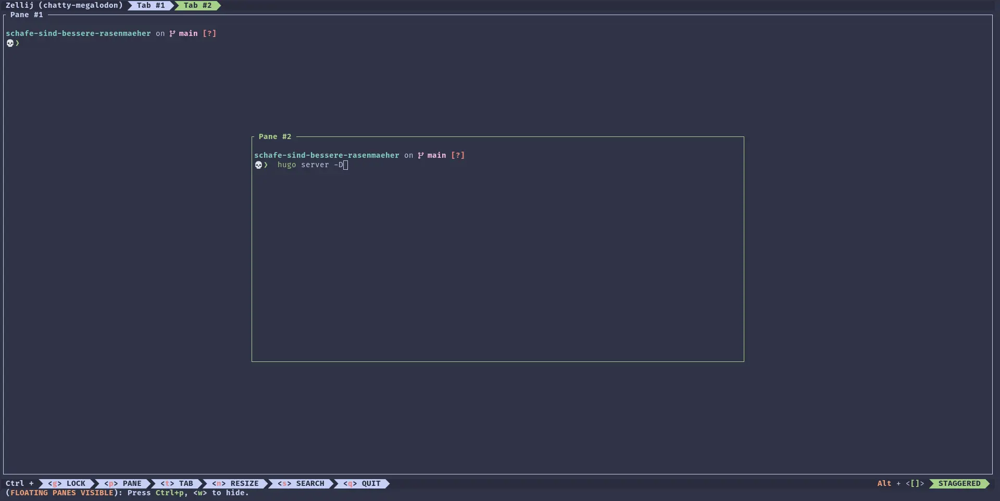

Here's what I've been up to this last week.

## Gaming

After a long drought without gaming (the little one kept going to bed well after 21:30), I finally found the time for a few hours of gaming with only minor interruptions.

I decided to finally take the plunge and play **Firewatch**. Reviews were very positive when the game came out, but I had originally put it on the _never, ever_ pile after not getting to it for **8 years**.

What brought it back to my attention was this essay by Caroline Delbert on itch.io: [Who watches the Firewatchers?](https://aeta.itch.io/who-firewatches-the-firewatchers). I ran into that in issue #13 of [The Pixel Prophet](https://buttondown.email/PixelProphecy).

Firewatch is yet another walking sim with emphasis on character interaction and a stunning visual art style. I think I'm close to the end now after 3-4h of play and I'm really hooked on the story.

Oh and it runs great on Linux!


_All images ©️ by Campo Santo and Panic (2016)_.


## Coding

I've had a few weeks without new additions to my toolbelt, but just yesterday I finally gave [**Zellij**](https://zellij.dev/) a try. And it's awesome.

I watched a bunch of screencasts today about it's features and I'm even more sold. I like that by default, there's a bar at the bottom showing you a bunch of shortcuts and what they will do. Pretty much like the **which-key** plugin for Neovim.

Okay, the screenshot might not sell you on it, but I recommend giving it a try. I've been pretty happy with **tmux** in the past and there's no _real_ reason to switch, but I felt like trying something new.

There are a few places where the default keybindings interfere with Neovim, but you can hit `CTRL+g` to lock the Zellij interface and pass all keys through to the running process.

## Bug of the week

Not sure if I'm gonna keep this in my weekly wrap-ups, because it might make the software I work on feel unprofessional. But this one is just too funny not to talk about.

The ticket summary read like this: _changing the pin twice without saving leads to errors_.

This was too funny not to look into when I found it, so I tried it out.

As it turns out, it will not just _lead to errors_. It pretty much nukes your config and all the services will start failing shortly after.

That's pretty bad. Especially because there should be safeguards in place so this can't happen. I dug into this some more and discovered why the services started failing. The config is split into two files. For security reasons, the files are encrypted with a pin. The same pin!

Well...at least they should be. What actually happened was that one part could be saved without any errors, but saving the other config part ran into an error. The error was caused by the config management UI not remembering the original pin. Remember that we changed the pin twice?

Let's break this down with _original pin_, _pin1_ and _pin2_.

1. We load the config with _original pin_.
2. We change the pin to _pin1_. The config manager remembers the _original pin_ as...well, the original pin. Let's say _current_ pin.
3. We change the pin again to _pin2_. Now the config manager remembers _pin1_ as the _current_ pin.

Upon saving we discover that the current config cannot be decrypted with _pin1_, so we run into an error. For reasons that I haven't figured out yet, there's no rollback of the other part of the config. The overall save process fails with an error in the UI, but the damage is already done. Services start failing, because they expect a uniform pin, but both config parts use different pins.

This was easy enough to fix. Actually, if you know what the hell happened, you can just decrypt the one config part with the new pin manually and encrypt it with the old pin again to get everything back online, but without the knowledge I've laid out in the last few paragraphs, you're pretty much screwed.

## Digital detoxing

I am constantly online.

And that's pretty exhausting.

I'm trying to get this back under control and one easy fix I found this last week, was to adjust the notification settings of my Android phone.

Android allows you to customize a whole lot about app notifications, but the most effective thing I found was to turn off sound and vibration.

I started doing this a while ago for apps push-notifying me with ads. In fact, I blocked such notifications entirely (looking at you Kindle and Amazon Shopping).

However, it took me an embarrassingly long time to realize that I can do that for much more. There's just a handful of apps on my phone that require my immediate attention. I suspect that it's mainly messenger apps and calendar notifications, but I've decided to reduce this incrementally to not miss out on anything by accident.

I've muted emails and my Mastodon client and my day has gotten noticeably quieter. It feels good.

I kept the banner notifications, because it's nice to know that a new mail came in or someone responded to one of my Mastodon posts, but none of that requires immediate action.

## Homelab

About a year or two ago I signed up with [**Protonmail**](https://mail.proton.me/). I'm pretty happy with most of their service, apart from the fact that I need a bridge app to access my mails via IMAP and SMTP.

I kinda understand how that defeats the whole point of E2E encryption, but all I want in the end is to be able to decide which tool I want to use to read my mails. And that is of course **Thunderbird**.

Access to the bridge requires a Protonmail subscription, which I'm happy to pay for. It's reasonably priced, although I'd still prefer it if it was also part of the free offer.

The Protonmail Bridge is available as a Flatpak for Linux desktops and I've been using that for a while. This week however, I found out about https://github.com/ganeshlab/protonmail-bridge-docker.

I'm now hosting this Docker container on my trusty Raspberry Pi 4. I can use the bridge with my desktop PC and my phone. I'm not ready to expose this to the public, but I found yet another neat tool in F-Droid that'll do the trick: [**WG Tunnel**](https://f-droid.org/en/packages/com.zaneschepke.wireguardautotunnel/).

I already have a Wireguard tunnel to my homelab and WG Tunnel allows me to turn on the Wireguard connection automatically when I leave the house. It'll turn the Wireguard VPN off again, once I'm back home, i.e. when it recognizes a _trusted WiFi SSID_.

I'll keep the Protonmail app on my phone for a while to see how well this setup actually works, but I've already switched over to K-9 (a.k.a. Thunderbird for Android).

## Wrapping up

Well, that's it for my first weekly wrap-up. Not much weekly about it yet, but I'm hoping that I can establish a rhythm here.

Thanks for reading. Feel free to reach out to me on Mastodon if you have questions or want to discuss any of these topics. I'm always happy to hear from you.
