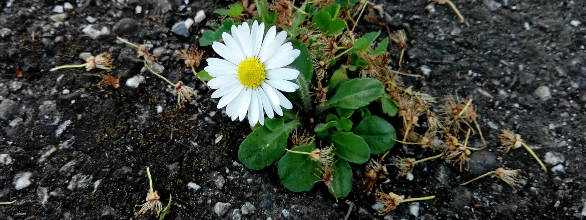

Meine Gedanken kreisen immer nur um das Eine. Wie konnte das nur geschehen? So jung. So unschuldig. Naja unschuldig vielleicht nicht unbedingt. Ich lache und erschrecke als ich das kalte, laute Wiederhallen der Wand höre. Der Raum ist dunkel, obwohl die Sonne durch die Fenster scheint. Mir fröstelt. Der Gang zur Heizung ist allerdings unnötig. Diese ist bereits an. Ein kurzer Griff an die Heizstäbe und eine verbrannte Handfläche später lehrt mich der Zahlenskala am Ventil zu vertrauen.

Eisiges Wasser rauscht aus dem Hahn und kühlt meinen geschundenen Handteller. Ich beobachte das Wasser, das spurlos im Abfluss verschwindet. So wie das Leben auch, denke ich mir. Traurig starre ich Sekunden, Minuten, vielleicht Stunden auf das fließende Wasser.

Es ist laut! Eine beruhigende Freude überkommt mich auf einmal. Natürlich verschwindet ein Leben nicht spurlos.

Optisch vielleicht. Haare fallen aus, die Haut wird schrumpelig und verwest, Knochen werden zu Asche, bis von einem Körper nicht viel mehr übrig bleibt, als Wassertropfen von dem kräftigen Strahl zuvor.

Aber so wie das Rauschen des Wassers von den Wänden des kleinen Badezimmers zurückschallt, so erzeugt das Leben auch einen Klang - egal ob nur ein einzelner Ton oder gleich ein ganzes Orchester - der von Menschen aufgeschnappt, reflektiert und weitergegeben wird.

Zufrieden stelle ich den Wasserhahn ab und beginne zu schreiben.

---

Für einen Freund.
