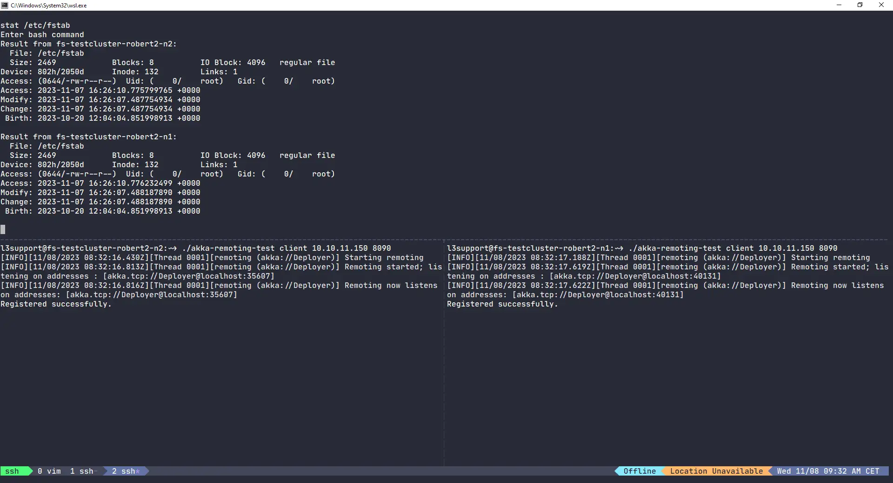

## Why I'm doing what I'm doing

About a week ago or so, the QA guys at work asked me if I could help them out a bit. The test scenario required deploying a cluster of VMs running our product and putting some load on it. After a short outburst from my side ("HOW THE HELL DO YOU NOT DOCUMENT THE WAY YOU TEST THINGS!?") we got talking about a cool _manager_ like application where we would be able to coordinate multiple clients running different load generators.

Here's a rough sketch of the idea that we formed.

- We want to have a manager instance with a web UI, where we can register different client systems.
    - Client systems include Linux and Windows, so we need to be able to compile the code for both OSs.
- We already have existing load generators, but we want remote executors to start them and relay log output from the console back to the manager instance.
- The web UI should show if a client has encountered errors or failed entirely.

Just recently I've written some remote executor classes for another application, but those used an actual SSH connection to the remote servers instead. If we want to work with Windows and Linux, I'd rather not use a "hacky" solution with SSH. Now, of course Windows has Remote-PowerShell, but I loathe it with a vengeance. I've messed around with Remote-PowerShell both with Terraform and Vagrant and ultimately threw out all the code and installed an SSH server on Windows instead.


The huge problem with Remote-PowerShell is that it requires a whole bunch of setting up first to trust remote clients. You'll need to open ports in the Windows firewall, create a certificate, add some trusted hosts...

It's quite possible that what I'm saying is wrong, because I always found it way too complicated.

SSH in comparison is simple and elegant. The setup can easily be automated and once you've added your trusted public key(s), you can get started right away.


Because some of my colleagues had used [Akka.NET](https://getakka.net) in the past, the framework came to mind readily. Akka is an implementation of the Actor Model, where Actors are independent processes (or rather C# `Task`s) that interact with each other via asynchronous messaging. It's well suited for concurrency, but the fact that I was more interested in was [location transparency](https://getakka.net/articles/concepts/location-transparency.html). In theory it should be easy to run an actor anywhere in the network and send it messages. Perfect!!!

> A word of warning: I'm not gonna explain much about what Akka is. If you're curious, you should head over to https://getakka.net and skim the landing page to get an idea.

I had tinkered with it years before, but I couldn't have written even a simple snippet of code without looking at the docs.

Luckily the docs at https://getakka.net are pretty good and after having read the "Getting started" articles I felt well prepared to write me some remote execution Actors, unit test them, message them in different patterns and coordinate them...**locally**!!!

## Getting remoting to work

Of course it's to be expected that the "Getting started" section of the docs at https://getakka.net wouldn't give me all the answers, so I delved into "Clustering", "Akka I/O" and finally "Remoting". Even though the [Remoting docs](https://getakka.net/articles/remoting/index.html) sent me back to "Akka I/O", I felt that the setup described there was overly complicated and not what I was looking for.

Instead, I found a suitable starting point for a client-server app at [Remotely Deploying Actors](https://getakka.net/articles/remoting/deployment.html). The article shows how to connect a `HelloActor` to an `EchoActor`, albeit between two processes running on the same machine. The setup is using TCP though, so it should be easy to move one of the processes onto another machine.

The crux is that you need to know how to setup your _Akka configuration_, e.g.

```text
akka {
    actor.provider = remote
    remote {
        dot-netty.tcp {
            port = 8080
            hostname = localhost
        }
    }
}
```

You'll need to know exactly what to put into this config for either the server or client. The example above is for a server, here's what the client config might look like.

```text
akka {
    actor{
        provider = remote
        deployment {
            /remoteecho {
                remote = "akka.tcp://DeployTarget@localhost:8080"
            }
        }
    }
    remote {
        dot-netty.tcp {
            port = 0
            hostname = localhost
        }
    }
}
```


I'm not going to copy over every piece of code from the [Remotely Deploying Actors article](https://getakka.net/articles/remoting/deployment.html), so if you're wondering where this config goes, head on over to the article or scroll down to find the link to a Git repo with my finished prototype.


At this point I started messing around with the `localhost` and `8080` values. There's not much else to configure, so that should suffice, right?

So obviously, you'll need to change this part in the client config

```text
remote = "akka.tcp://DeployTarget@localhost:8080"
```

into something like

```text
remote = "akka.tcp://DeployTarget@<my-server-name-or-ip>:<remote-port>"
```

But that wasn't enough and it took me another hour or so to figure out why.

You also **must** make sure that the `hostname` in the _server_ config matches the hostname that the client expects:

```text
remote {
    dot-netty.tcp {
        port = <remote-port>
        hostname = <my-server-name-or-ip>
    }
}
```

That should get the example working over an actual network connection. For convenience I made the `hostname` and `port` configurable and read them from the starting arguments.

## Unwrangling my brain

At this point I had a bit of trouble understanding what happened where. I could see that I had connected a `HelloActor` to an `EchoActor`, but I couldn't really tell which process was doing what.

So I experimented a bit with inverting the roles, i.e. I instantiated a remote `HelloActor` that sent messages to my _client_ `EchoActor`. Using `Environment.GetEnvironmentVariable("HOSTNAME")` I quickly figured out where each Actor was located and to confirm my theory I spun up another instance.

At this point I noticed that even though I had understood where my Actors were and from where they were instantiated, I hadn't actually built a client-server app yet. At least not in the sense I was thinking of.

What I wanted to do was have a `ControllerActor` running on my _server_ and register remote `ClientActors` with it. So the last piece of the puzzle was to figure out how to instantiate a single `ControllerActor` on my _server_ and get a reference to the Actor from a remote _client_, so I could send messages to it.

And here it is:

```csharp
string remoteHost = "<my-server-name-or-ip>";
string port = "<remote-port>";
string actorPath = $"akka.tcp://DeployTarget@{remoteHost}:{remotePort}/user/controller";

ActorSelection selection = system.ActorSelection(actorPath);
Task getReferenceTask = selection.ResolveOne(TimeSpan.FromSeconds(30));
IActorRef actor = getReferenceTask.Result;
```

Registering a `ClientActor` was then pretty easy. All I needed to do was instantiate a `ClientActor` with my _remote_ `ActorSystem` and hand over the reference to the `ControllerActor`. From there on out, I could work with `Tell()` and start adding commands.

## The finished prototype



I put my code up on https://codeberg.org/rluetzner/akka-remoting-test . It is not the prettiest code and if you're an Akka.NET expert you'll likely run away screaming or burst into tears laughing, but it gets the job done.

_This_ is the article and _that_ is the code I've been looking for, for the last two days. 😅
