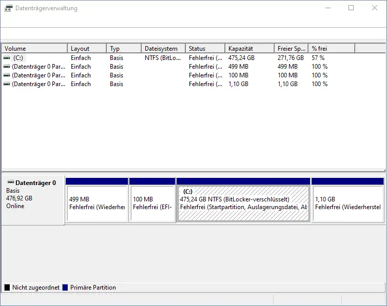

I love WSL. I mainly develop for Linux systems at work, but for company reasons am forced to use a Windows machine. WSL is the next best thing and I've been spending almost my entire time the last few years inside this sweet Linux environment.

A few days ago however, I managed to almost destroy my WSL instance. It took me a while to figure out what exactly happened, but here it goes.

## The prose story

As the new year started, I took some time to clean up my system. I noticed that my drive was running pretty low on space and ran **TreeSize** to analyze which files were the cause. I found an old development VM that used up more than 100GB, which I finally deleted after not booting it up for more than two years.

I should have been satisfied with this huge freed up space, but I kept digging. I found out that my WSL instance takes up about 40GB, which I found weird, because there aren't really that many big files in there. I dug through my notes and found the following commands.


**WARNING!!!**

**Although I've run these commands successfully in the past, this is part of what sent me on my way of destruction.**


```powershell
# As Admin
# Requires the Hyper-V PowerShell Module to be installed.
# Also requires Hyper-V services to be installed.
# wsl and Docker Desktop must first be stopped:
#   wsl --shutdown
#   Stop Docker manually by clicking the icon.
Optimize-VHD -Path $env:LOCALAPPDATA\Packages\46932SUSE.openSUSETumbleweed_022rs5jcyhyac\LocalState\ext4.vhdx -Mode Full
```

After running this command, I was unable to start WSL again. It failed with an error message that sounded like _used by another process_, i.e. something on my system was blocking access to the file.

I ran **Unlocker**, but couldn't find the cause. I did some internet research and found a comment that prompted me to check the Windows Disk Management dialog. There should be a virtual disk that I was supposed to unmount.



For whatever reason, in between reading this post and opening up the dialog, I forgot all about the virtual disk and especially why it would be there in the first place. So when I opened up the dialog, I was confronted with a message box.

I tried to reproduce the issue, but I couldn't manage to force it again. So all I can do is describe the contents of the message box to the best of my knowledge.

If you've worked with Windows and ever added a new disk to a system, you've probably seen this prompt before.

_We found a new disk that's not initialized. Would you like to initialize it?_

I clicked _yes_ and all of a sudden I had a shiny new _virtual disk drive_. Only...I got the sinking feeling that I did something horribly, stupidly wrong. 😨

Now my WSL still didn't want to start, but the error message changed ever so slightly.

```text
A connection attempt failed because the connected party did not properly respond after a period of time, or established connection failed because connected host has failed to respond.

[process exited with code 4294967295]
```

Okay, now what? I spent a lot of time looking up parts of this message. Interestingly enough the error code[^error-code] yielded some results, although I had to dig deep through a bunch of solutions that simply wouldn't work for me.

I finally found [this answer](https://github.com/microsoft/WSL/issues/5092#issuecomment-1332427373) -- the steps of which I'm going to describe shortly -- and now everything clicked.

## What happened

What I didn't know before is that the contents of a WSL instance are saved in a Hyper-V virtual disk. I mean I could have and probably should have known (going by the `.vhdx` file ending), but I didn't put two and two together. 😅

What Optimize-VHD does is

- mount the disk locally and
- run some optimizations, defragmentation, whatever on it.

The command should end up unmounting the virtual disk when it's finished, but it seems like I'm not the only one for whom that didn't happen.

When I opened up the Windows Disk Management dialog, I was prompted to initialize the disk, because Windows wasn't able to read the partition table written by Linux.

Of course I then trashed the existing partition table with the Windows MBR and now Linux (or rather WSL) was no longer able to read it.

## How I fixed it

Again, it's all thanks to [this answer on GitHub](https://github.com/microsoft/WSL/issues/5092#issuecomment-1332427373). 🚀🎉

I never would have managed to figure this out on my own.

First, I installed a new WSL instance -- Ubuntu -- from the Windows Store. I chose Ubuntu for two reasons.

1. I could not install openSUSE Tumbleweed again. I would have had to delete my existing installation, which I wasn't yet willing to give up.
2. The commands and packages mentioned in the comment I found on GitHub were meant for a Debian/Ubuntu system and I didn't want the hassle of finding their equivalents on an openSUSE system.

I started up the Ubuntu instance and ran the following commands. These are not exactly the commands you will find in the GitHub comment, because some of those have since been deprecated.

```bash
sudo apt update
sudo apt-get install libguestfs-tools linux-image-generic

# List all partitions from the virtual disk.
sudo virt-filesystems --all -a /mnt/c/Users/robertl/AppData/Local/Packages/46932SUSE.openSUSETumbleweed_022rs5jcyhyac/LocalState/ext4.vhdx
# In my case this listed
# /dev/sda
# /dev/sda1

sudo virt-rescue -a /mnt/c/Users/roberts/AppData/Local/Packages/46932SUSE.openSUSETumbleweed_022rs5jcyhyac/LocalState/ext4.vhdx

# You've now entered rescue mode for virtual disks.
e2fsck -y /dev/sda
```

After this is finished, I was able to start my openSUSE Tumbleweed instance again. No data was lost.

## What I've learned

I already mentioned that I've learned a bit about how WSL is implemented, i.e. that the data is stored in a Hyper-V virtual disk file hidden away in `%LOCALAPPDATA%`.

I wasn't really worried about losing any vital data. I regularly push the code I write, so no work progress would have been lost.

I usually put my scripts into versioning as well, but I had a few files lying around that came in handy recently and I hadn't yet figured out where to put them.

There were also my config files. I'm not a huge tinkerer when it comes to dotfiles, but my global gitconfig contained some aliases I relied on heavily and wasn't sure I could recreate/find again.

I've also spent some time filling out my `.ssh/config` so I can easily access a bunch of servers without having to remember the matching private key, username, port, ...

I've been eyeing [chezmoi](https://www.chezmoi.io) as a backup/versioning option and I finally took the leap. It's been a very pleasant experience and it didn't take half as long as I expected to get my environment versioned. I've already started with some scripts to help get a clean system up to speed quickly.

I'm glad I could recover from my mistake, but as always: no backup, no mercy! If you're reading this and think to yourself _wow, this sounds scary_...how about some backup? 😊

I can really recommend [chezmoi](https://www.chezmoi.io) for dotfiles (and even some scripts you don't know where to put) and I'm planning on adding another blog post about that experience soon.

Stay tuned and thanks for reading!

[^error-code]: Seriously Microsoft...you can't tell me that there's anybody who knows exactly what the magic error code 4294967295 means.
