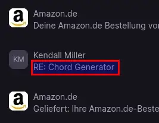
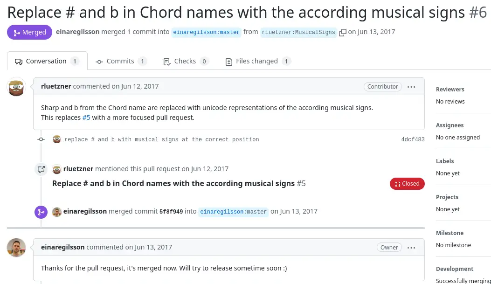
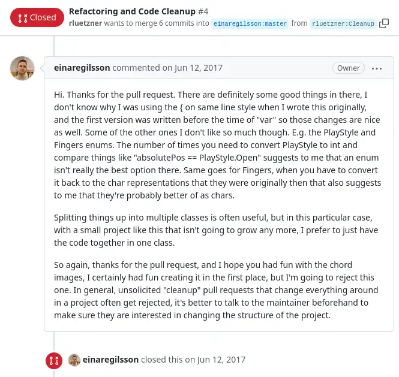
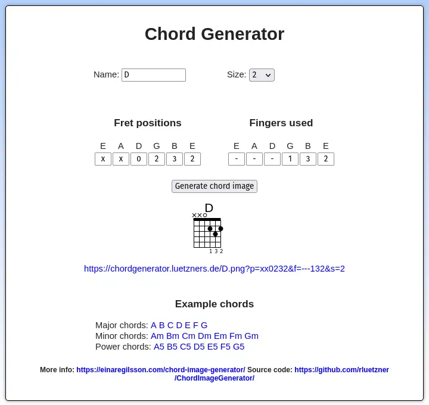

On Monday the 6th February of 2023, I woke up to find a surprising email in my inbox.

## What is a Chord Generator?!

Let's go back a little in history...

Back in 2017 I remember talking to my boss at work about GitHub. I mentioned, that I had a GitHub account, but at that time I only had one project uploaded and otherwise not interacted with it. He then encouraged me to seek out open source projects that pique my interest and see if I can contribute to them.

I did so that very evening. My search criteria were simple: it had to be written in C#, the only programming language I was semi-fluent in at that time, and I wanted it to be a smaller project, because it felt less intimidating than starting with a well-known one.

After a lot of searching I settled on this one: [Einar Egilsson's Chord Generator](https://github.com/einaregilsson/ChordImageGenerator).

The project grabbed my interest, because besides programming I was also an avid guitar player at that time.

I cloned the repo and ran the project. Pretty much immediately I saw that optically the output could be improved by converting 'b' and '#' to their [musical representations](https://github.com/einaregilsson/ChordImageGenerator/pull/6) '♭' and '♯'.

I also made a complete fool out of myself heavily refactoring the small code base, which Einar correctly rejected when I sent him a [pull request](https://github.com/einaregilsson/ChordImageGenerator/pull/4). He was very civil about rejecting that one and gave me solid advice for the future.

Here are basically my only interactions with the project and Einar Egilsson.

## Back in 2023...an unexpected mail

Here is a slightly abbreviated version of the mail I opened up **six years** later, with permission from Kendall Miller.

> Hello Robert!
> 
> I see you’ve contributed to GitHub’ s “Chord Generator” site. Recently I tried to access this resource to create chords but the site was inaccessible: the “404 Error” code appeared on the screen. So, I looked up the developer to text him and found this: Einar Þór Egilsson was born in Reykjavík on August 23, 1980. He died in the Canary Islands on January 10, 2022. [...]
> 
> I’m hoping there is some way to still access this “open resource;” and, I was hoping that you had the expertise to tell me if this is so. [...] I’m sick to my stomach that this resource may be gone. I used it all of the time; and fairly recently, it stopped being accessible. [...] I’m [...] an avid guitar transcriber (I’ve worked w/ the late Kenny Rankin and Stephen Bishop...creating detailed tablatures of their songs. Einar’s site was invaluable for this purpose allowing me to create any odd chord that might ever be needed!
> 
> Thank you for your time. I look forward to hearing from you.
> 
> Warmest Regards,  
> Kendall Miller

That took me by surprise. Even though I didn't know Einar personally, I felt a pang of sadness for his sudden passing. He died young and in seemingly best health. At a later point I found a comment from him on GitHub, where he promised somebody to take a look at their pull request after his vacation ended -- in early January of 2022.

I promised Kendall to take a look at the project and try to restore an instance of the Chord Generator web service.

> Hello Kendall,
> 
> I'm sorry to hear about Einar. My only interaction with him was a single contribution to the Chord Generator tool back in 2016 (I think?), but nevertheless, I'm saddened to hear of his demise.
> 
> [...] I'm 99% sure I could easily provide you with an alternative web address, but restoring
> http://chordgenerator.net/ will be very hard, seeing as the web domain is still owned by Einar.
> 
> As I've said before, I only contributed once to the project, but I'd be willing to keep it alive for the time being. However, from what I've seen, Michail Vourlakos seemed to be a bit more involved. I'm sure you've contacted him as well. If he is willing to continue the project, I'd rather give him precedence.
> 
> For now, I'll have a look at the code this evening (CET) and try to get a test instance of the service up and running.
> 
> Best regards,  
> Robert


In case you're wondering: Michail Vourlakos never came back up.

I haven't contacted him directly as of the time I'm writing this, but he also didn't react to any of my movements on the original project on GitHub.


## Getting my hands dirty

Getting started turned out to be a bit more involved than I first expected.

I had made the switch to Linux on my private machine about a year before and my initial plan was to deploy Chord Generator to my trusty Rapsberry Pi. From work I knew that .NET worked perfectly well on Linux, so I thought that the migration should be trivial.

I forked and cloned the Git repo and was overjoyed to find that Einar had already mostly converted it to .NET Core 2.2.

_Yay! So the project is already cross-platform!_ 🤩

I installed .NET 6 on my machine and tried running the code, but the compiler immediately complained that the .NET Core 2.2 SDK wasn't available. I tried for a while to download older versions of the .NET SDK, but gave up after half an hour of searching. There's probably a way, but I couldn't find it.

So, I decided to upgrade the project to .NET 6. While the upgrade steps to .NET Core 3 seemed daunting at first, I realized that in this specific case there weren't much breaking changes. I was able to upgrade the project to .NET 6 in less than half an hour.

However, I then had to find out that the System.Drawing.Common namespace used in the original project has been [deprecated on non-Windows machines since .NET 6](https://learn.microsoft.com/en-us/dotnet/core/compatibility/core-libraries/6.0/system-drawing-common-windows-only).

_Well shit!_ 😩

I couldn't figure out how to install older SDKs and I couldn't just upgrade the project, because a vital dependency no longer worked (on Linux aka non-Windows).

After maybe half an hour of experimenting with different alternatives (as found on [StackOverflow, where else!?](https://stackoverflow.com/a/44428480)) I was close to giving up.

Giving up, as in renting a Windows VPS somewhere to get the project up and running. At least for a while until I figured out how to migrate the code.

As my final ray of hope, I turned to Docker.

## Now we're docking!

At first glance the [.NET SDK Docker page](https://hub.docker.com/_/microsoft-dotnet-sdk) didn't look too promising. The only featured tags were _6.0_ and _7.0_, which wouldn't get me very far.

After a bit of digging however, I turned up an ugly [JSON formatted list of old tags](https://mcr.microsoft.com/v2/dotnet/sdk/tags/list).

I wrote a quick and dirty Dockerfile to see if the project would build and run. And lo and behold...**it did**! 🤩

Kendall had sent me an example tabulature containing chords from the original Chord Generator. Upon closer inspection I saw that the results weren't exact 1:1 matches, but they were close enough to be usable. This is due to the `libgdiplus` reimplementation generating slightly different results compared to `GDI+` on Windows, which is cited as the main reason it is no longer supported starting with .NET 6.

Nevertheless, I was happy to have gotten this far. I fiddled a bit with `docker buildx`, but ultimately ended up pushing the code, checking it out on my Raspi and building an ARM64 image there.

This is the mail I sent on the evening of the February 6th.

> Hello Kendall!
> 
> [...]
> 
> I'm working on setting up another Chord Generator site. As mentioned before, I won't be able to update Einar's website, so you'll need to use a different address. As soon as I've got everything set up, I'll send you the link.
> 
> [...] Things are looking pretty good and I ...
> 
> Sorry for the interruption, but I thought I might leave it in. So I left some processes running in the background while writing this email and now I've actually got a service up and running for you:
> 
> https://chordgenerator.luetzners.de
> 
> I hope it continues to serve you well. Feel free to contact me if anything isn't working as expected.
> 
> Best regards,
> Robert

And here's the response. 😊

> Hello Robert,
>  
> Oh my goodness! I just opened your "Chord Generator" page and it works PERFECTLY! Thank you so much for restoring this resource! I can't thank you enough for allowing this project, to which you contributed, continue into the future for others. I don't think you know just how appreciated you are....
> 
> It's been an honor to correspond with you!
> 
> Your friend,
> Kendall Miller

## Bugs, bugs, bugs...and an outlook

The heading makes this sound more dramatic than it actually was. On the next day Kendall reported two smaller bugs, which I was able to fix the same day. 😅

I've since put in some work in upgrading this project to .NET 6. I initially intended to stop at .NET 5, but for whatever reason, the deprecation exception for System.Drawing.Common didn't trigger in a .NET 6 container.

I've also started replacing System.Drawing.Common with [ImageSharp](https://github.com/SixLabors/ImageSharp). I was hoping to find a project that would retain the same API, but Einar was using very low-level methods to draw the chords and I was unable to find a suitable replacement. At the time of this writing, the changes are not yet merged. Technically, everything is in order, but the end result differs a tad too much for me to be satisfied.

In addition to that, I've tracked down the person managing the late Einar's GitHub account. I've contacted them via mail and opened up an [issue](https://github.com/einaregilsson/ChordImageGenerator/issues/11) on the original project page, but haven't heard back so far.

## Resources on Einar Egilsson

The most I've learned about Einar has been kindly provided by Kendall, who did a lot of research.

Apparently he hit it big time back with his company Rauðás Hugvrijð and [CardGames.io](https://cardgames.io/). 

[Here's](https://www.vb.is/frettir/gamaldags-netleikjasida-malar-gull/) an icelandic article about their success story.

There's also an [obituary](https://www.mbl.is/mogginn/bladid/innskraning/?redirect=%2Fmogginn%2Fbladid%2Fgrein%2F1801229%2F%3Ft%3D701296233&page_name=grein&grein_id=1801229) on another icelandic news site.


You'll have to find a ways to translate them yourself; I was unable to find a privacy-friendly solution.


There's also [Einar's blog](https://einaregilsson.com/), which luckily is in English.

Here are some articles I've read, although I haven't read that many (yet):

* [The story of CardGames.io](https://einaregilsson.com/story-of-cardgames-io/)
* [An easter egg for one user: Luke Skywalker](https://einaregilsson.com/an-easter-egg-for-one-user-luke-skywalker/)
* [Chord Image Generator](https://einaregilsson.com/chord-image-generator/)

## Closing thoughts

I'm still amazed that Kendall found me via a GitHub contribution I made six years ago. Writing this blog post helped make this a bit less surreal. 😅

I'm really happy that I was able to restore this tool and help Kendall continue working on tabulatures. I hope that other people who might have used Einar's tool will eventually find out about the new URL. And, of course, I'm happy to keep a part (however small) of Einar Egilsson's legacy alive.

Finally, to paraphrase Einar Egilsson from his blog post about the Chord Image Generator:

> You are free to link to images directly on https://chordgenerator.luetzners.de from your own website, although I make no guarantees about uptime, performance or anything like that.

Enjoy! 🙂

----

## Edit - 2023-04-14

I've reached out to [Gissur Thorhallsson](https://github.com/gzur), who's taken ownership of Einar's account, and they kindly added a note to the original repo, pointing to my fork. The [original repo](https://github.com/einaregilsson/ChordImageGenerator) on GitHub has been archived. Now it's official: I've have fully inherited this project.

Gissur also promised to look into ownership of the domain https://chordgenerator.net, but with the added link on the original repo on GitHub I'm optimistic that people will find their way to https://chordgenerator.luetzners.de.
