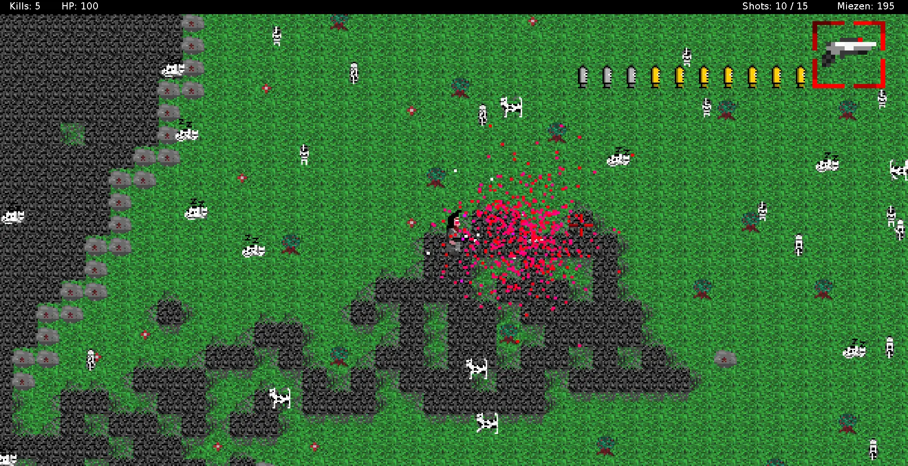

Back in 2015, after I had graduated from university, I was looking for jobs. I had a major in Physics, but my heart was no longer in it. Instead I wanted to write computer programs. After writing countless applications and receiving a few rejections (and a whole bunch of nothing), I finally hit a breakthrough. A small local company was willing to invite me for an interview.

It was in August of 2015, which I remember very well, because it was an incredibly hot day and I came fully armored in a suit[^suit]. I was expecting to be interviewed by some kind of total hard-ass boss (also in a suit) that would quickly dismantle my "pretend" knowledge of programming[^impostor_syndrome]. What came in were three guys, dressed in T-shirts, shorts and flip-flops.

We chatted for a bit and the whole atmosphere felt like some kind of _magic_ to me. **This** is where I wanted to be. **This** felt **right**.

I was ecstatic when they called me back and invited me to come in. I was supposed to meet the team, show off some skills by attempting to solve a problem over the course of the day and --

"You mentioned you were working on a game. How about you give a short presentation on that?"

Gulp. 🤢

"Yeah, sure..."

I was working on a game -- about shooting cats into bloody little bits. 😨

----

Let's jump back a bit in time. You know what!? Let's jump right to the beginning.

Back when I was at school, I always wanted to write computer programs.

Of course I mostly dreamed about developing games, but even without that I was always drawn to solving a specific problem once and coming up with an algorithm to have a computer do it for me.

Back in school -- must have been the 7th grade in 2000, so I was 13 -- I started out with very basic choose-your-own-adventure style text adventures -- ironically written in Quick BASIC. I stumbled upon BASIC and the QBasic IDE via a CD that came with a gaming magazine. I think they were running an article on homebrew retro styled games and shipped the whole shebang.

The code I wrote was just a bunch of `GOTO` instructions. There was no inventory and the most mindblowing thing in those games was that you could enter custom names for the characters in the story. I enjoyed the creativity that came with it, but didn't really dive any deeper into BASIC.

A year later in 8th grade we had an introductory course into computers. It was called _informationstechnische Grundausbildung_ (eng: _basic training in information technology_) or ITG for short. None of our teachers were actually equipped to give such a course, at least not on the then current state of technology, so they probably just chose the few teachers that could turn on computers. We ended up with one of the better teachers that not only taught us how to turn on a Windows PC, but also how to use

- [Lotus Notes](https://en.wikipedia.org/wiki/HCL_Notes) (a word processor -- initial release: 1989),
- [Lotus 1-2-3](https://en.wikipedia.org/wiki/Lotus_1-2-3) (a spreadsheet program, the _killer_ application of the IBM PC -- initial release: 1983) and
- [Turbo Pascal](https://en.wikipedia.org/wiki/Turbo_Pascal) (IDE for the Pascal programming language -- initial release: 1983).

While I wasn't particularly interested in learning how to turn on a PC (I obviously already knew how to do that), writing application letters (I was 14!!!) or managing spreadsheets (...I mean, come on...), I immediately took a liking to Turbo Pascal. The IDE was a terminal UI, similar to what I already knew from BASIC. But now I had someone who could actually teach me about variables and leveraging them to do mathematics. I caught on quickly and was probably the only one who really enjoyed these coding sessions.

After that I dabbled a bit in Visual Basic and in later grades with Borland's Delphi, both of which didn't really pique my interest. Even today, I still don't like designing UIs.

When it came time to attend university I suddenly got cold feet when I heard that there were strict and harsh requirements to study Computer Science at Freiburg[^wrong_info]. So I signed up for a diploma [^yes_im_old] in Physics instead. In the last few school grades I had become enamored with the way formulae from classical mechanics were able to predict motion and I was eager to learn more.

Sadly that's only the first few semesters of Physics and is quickly overtaken by the much harder, much more confusing world of quantum mechanics. I took some computer science classes too, because I needed a minor. The focus was very much on classic algorithms, datastructures and whatnot. It didn't help that during the first semester we used [Scheme](https://en.wikipedia.org/wiki/Scheme_(programming_language)) -- a Lisp dialect nobody in the course had even heard about before [^book_about_scheme].

At the time I wasn't really interested in assembling my tool kit, so having to solve the weekly sheet of problems with specific algorithms didn't bring me much fun. I quickly started slacking off (as in, I had a major that was taking up almost the whole week already) and programming faded into the background again.

Let's jump ahead from 2008 to 2012. My resolve to major in Physics had been tested and I barely managed to keep with it. Quantum mechanics had quickly lost me and close to the finish line I felt very overwhelmed with the amount of studying up I had to do. I ultimately passed with good grades, but by then I had already decided to seek my fortune elsewhere.

But it was exactly at that time, when I was writing my diploma thesis[^masters_thesis], that I rediscovered my love for solving problems with a computer. I was working in an experimental physics department, where basically all the time we had to plot data collected from experiments to see if it matched our theory. I got a short introduction into [Mathematica](https://en.wikipedia.org/wiki/Wolfram_Mathematica) and later [MATLAB](https://en.wikipedia.org/wiki/MATLAB). The introductions were very basic and I often observed others simply repeating steps over and over again for each new set of data they needed to plot.

About a week later I had written a collection of 5 or 6 scripts that would apply some mathematical functions to find me a minimum and maximum in a set of data, scale the plot automatically, do a linear regression, plot a graph in multiple dimensions with sliders, you-name-it. From then on it took maybe a few days more until I was the group's computer expert. 😅 To the dismay of the professor overseeing my thesis, I took on more and more script writing tasks on the side, neglecting the research I actually should have been pursuing. Nevertheless, I ultimately handed in a finished thesis and was -- to my own surprise -- rewarded with a grade I'm still proud of.


Now if you're asking "where's this cat killing _Miez Attack_ game you promised?" We're getting to that. Don't worry. 😁


I graduated in 2014 and suddenly found myself confronted with an incredible amount of free time I didn't know how to fill[^unimaginable]. After a while I had played all the games, watched all the movies and read all the books I wanted. I became mildly depressed, because I sent out application after application, but nobody wanted to give me a chance at anything other than Physics. And I **definitely** was done with that. Feeling unproductive, I decided to take up programming again. This time, I would really sit my ass down and master a language.

Well the motivation described in the previous sentence lasted about a week and then I discovered [The Cherno](https://yewtu.be/channel/UCQ-W1KE9EYfdxhL6S4twUNw) on YouTube. At the time he was releasing new episodes of "how to build a game engine in Java", so I tagged onto that.


Nowadays I'm frustrated whenever tutorials are video-only, but back then the videos matched up pretty much perfectly with my learning speed.

Even though I dislike video tutorials, I have to admit that there's not much else that will get you really hyped for something than having someone describe why it's f-ing awesome!!!


The first few days I mostly copied over code I saw in Cherno's videos...where copying over meant typing everything I saw from scratch. I made a real effort to understand as much of it as possible. I'm still an idiot when it comes to drawing graphics to a screen, but once I have a piece of code that gets this done, I can understand pretty much everything else.

The game engine was for a 2D, top-down sprite-based action RPG game. I learned how to create a spritesheet, populate a map with sprites, animate a character and implement simple collision. Around that time I had a very badly drawn pixelated dude in a grey trenchcoat (and a bad haircut) walking around on grass sprites. I distinctly remember pausing the playlist and thinking: "that guy feels lonely. There should be someone else." 🤔

And on my way to the kitchen, I encountered my roommate's cat.

Coming back with a plate of food and something to drink, I sat down to animate a pixelated version of the little cat. I added some very basic AI, so it would move a bit in a few directions. And -- because our _Miez_ mostly spent her days sleeping -- I added another animation where the cat would just snooze for a bit.

And then the next video in the playlist was "make the character throw fireballs". And things kinda escalated from that. 😅

There was another video that showed how to add particle effects that I quickly abused to sprout fountains of blood when a poor kitty had been fatally wounded.

I added _evil_ cats (color-swapped from white to red) that would hunt the player.

Cats would be set on fire when killed by fireballs.

They dropped weapons and health kits. Weapons became more and more over-the-top, up to the _Shotgun-Rocketlauncher_ which fired a spread of three missiles.

Parts of the environment became destructible.

I added _Cathulhu_ as a boss.

There's no real "game" to be had. It's mostly a wild pixelated killing spree, where -- sadly and shamefully -- you shoot cats.

You shoot cats, because I lived with a guy who owned a cat and I just so happened to meet her on my way to the kitchen.

Yeah, so -- about that presentation. 😅 I did indeed put together a PowerPoint presentation, which I actually still have and is now preserved [here as a PDF](miez_attack_presentation.pdf).



I remember that a _random_ guy had also joined the presentation. I had looked up his picture on the company website, but didn't recognize him in person and he didn't state his name, so I didn't fully realize at that time that I was giving this weird presentation to the CEO of the company. 🤣 It's a small company, but still...

Since then I've made the [source code](https://codeberg.org/rluetzner/miez-attack) available publicly. Initially on GitHub, but I've since moved it over to Codeberg, together with my other Git repos.

After I started working full-time I dropped this project. I made a few smaller changes after the presentation, but I haven't done any _real_ work in 8 years. I came back about 2 years ago to add a 'Makefile', making it easier to build and preserve. "Load this into Eclipse and push this button" were instructions I couldn't tolerate any longer. 🤣

Anyway, it was never meant to be published in a big way. Getting the source code out there is the most I ever hoped for. And having a good story to go with it, doesn't hurt. 🙂

Thanks for reading. I hope you enjoyed this little story. Ultimately, I'm not sure how much writing this game about shooting cats actually influenced the decision to hire me as a software developer, but I like to think it did at least a little.

I've been very happy since and I'm glad to report that the feeling of **rightness** I had in the beginning did not disappoint.

**This** is what I was supposed to do.

I might not change the world where I am, but after 8 years I'm ready to say that I turned out to be a hell of a good software developer.

Oh, and I'm sorry about the cats. I admit that I like dogs more than cats, but I do still **like** cats. I hope you believe that I'd never hurt a cat in real life. Anyway, sorry if this made you uncomfortable in any way. I'm not entirely proud of having made a game about shooting cats, but...here we are... 😅

[^suit]: Being suited up came as a hard learned lesson from a job interview where I turned up "casual" with just a pressed shirt and suit trousers, but no jacket. 🙄 Said interview was maybe a week earlier. Remember: **HOT**!!! 🥵
[^impostor_syndrome]: I struggled with _[impostor syndrome](https://en.wikipedia.org/wiki/Impostor_syndrome)_ for multiple years. At that point it's kinda understandable, because I showed up without any credentials or proof at all that I could do the job, but it stayed with me longer than I'd care to admit.
[^wrong_info]: Turns out I was misinformed. I could have easily signed up for it as a major, although nowadays I don't feel like I've missed very much.
[^yes_im_old]: Yes, I'm old. 😅 If you don't know what that is, it's basically the same as a master's degree everywhere else.
[^book_about_scheme]: The stated reason to use Scheme was, so everybody would start from scratch. I suspect the fact that the professor had just recently published a book about Scheme -- which he warmly recommended for the course -- might also have had something to do with it. 😉
[^masters_thesis]: Master's thesis.
[^unimaginable]: Unimaginable today, as a full-time working dad of two.
